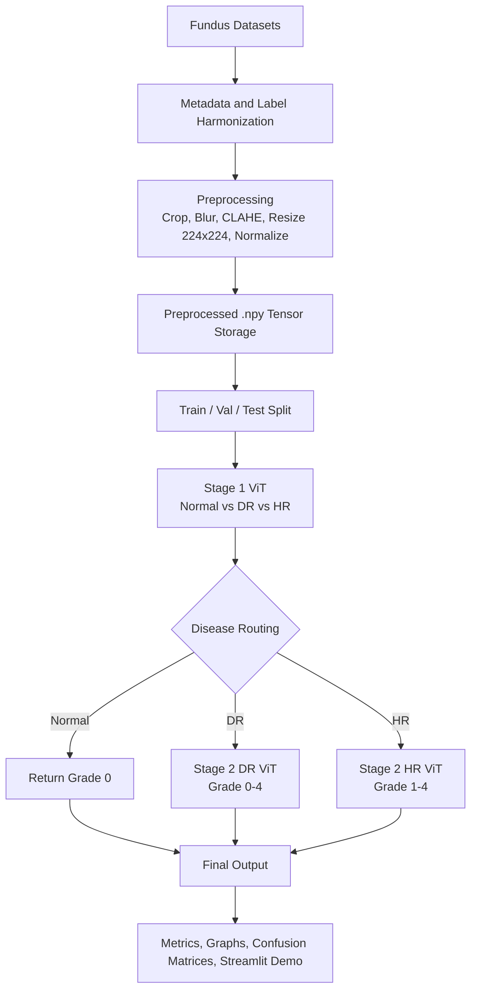

# Retinal Disease Vision Transformer Pipeline

This project builds a two-stage Vision Transformer pipeline for retinal fundus analysis:

- Stage 1 predicts `Normal`, `Diabetic Retinopathy (DR)`, or `Hypertensive Retinopathy (HR)`.
- Stage 2 routes to the matching disease-specific severity grader.
- The final output reports `disease`, `severity`, and `confidence`.

## Flowchart



## Repo Layout

- `src/data/`: metadata building, preprocessing, and split generation
- `src/models/`: Stage 1 and Stage 2 ViT models
- `src/training/`: training entrypoints
- `src/eval/`: metrics and plot helpers
- `src/inference/`: predictor and demo runtime
- `app.py`: Streamlit demo

## Setup

```bash
pip install -r requirements.txt
```

## Data Pipeline

1. Build unified metadata:

```bash
python src/data/build_master_metadata.py --config configs/data/data_config.yaml
```

2. Preprocess images into normalized `.npy` tensors:

```bash
python src/data/preprocess_images.py --config configs/data/data_config.yaml
```

3. Create leakage-safe train / val / test splits:

```bash
python src/data/make_splits.py --config configs/data/data_config.yaml
```

## Training

Train Stage 1:

```bash
python src/training/train_stage1.py --config configs/model_stage1.yaml
```

Train Stage 2 DR:

```bash
python src/training/train_stage2_dr.py --config configs/model_stage2.yaml
```

Train Stage 2 HR:

```bash
python src/training/train_stage2_hr.py --config configs/model_stage2.yaml
```

## Streamlit Demo

The demo expects trained model files at:

- `reports/stage1/best_model.keras`
- `reports/stage2_dr/checkpoints/best_model.keras`
- `reports/stage2_hr/checkpoints/best_model.keras`

Run:

```bash
streamlit run app.py
```

## Notes

- `image_path` in metadata is expected to point to a preprocessed `224x224x3` float32 normalized `.npy` tensor.
- `raw_image_path` preserves the original fundus image.
- Stage 2 severity is disease-specific, so DR grade and HR grade should not be compared as one shared scale.
