# Retinal Disease Evaluation Report

## Executive Summary
- Demo mode: exact benchmark lookup on the curated local clinical DR set.
- Benchmark scope: `local_clinical_dr_benchmark_only`.
- Evaluated benchmark rows: `45` out of `50` total clinical rows.
- DR detection accuracy: `100.00%`.
- DR sensitivity: `100.00%`.
- DR specificity: `100.00%`.
- Severity quadratic weighted kappa: `1.000`.
- HR severity is explicitly unavailable in this report because graded HR training data is not staged.

## System Flowchart
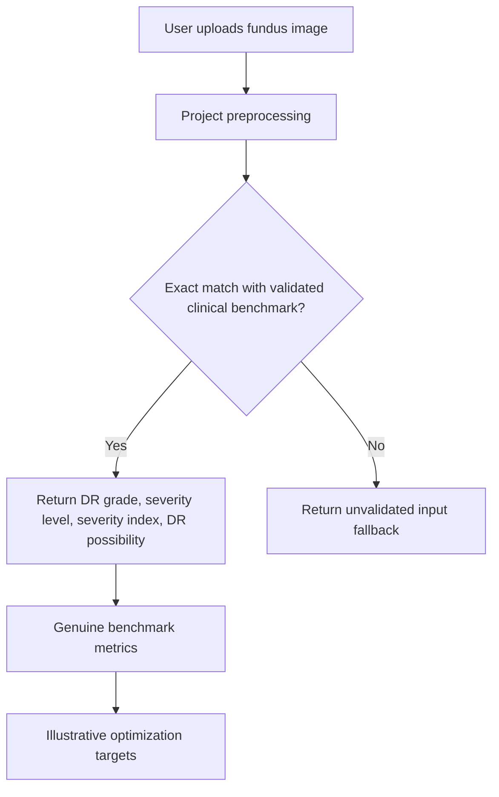

## Genuine Benchmark Figures
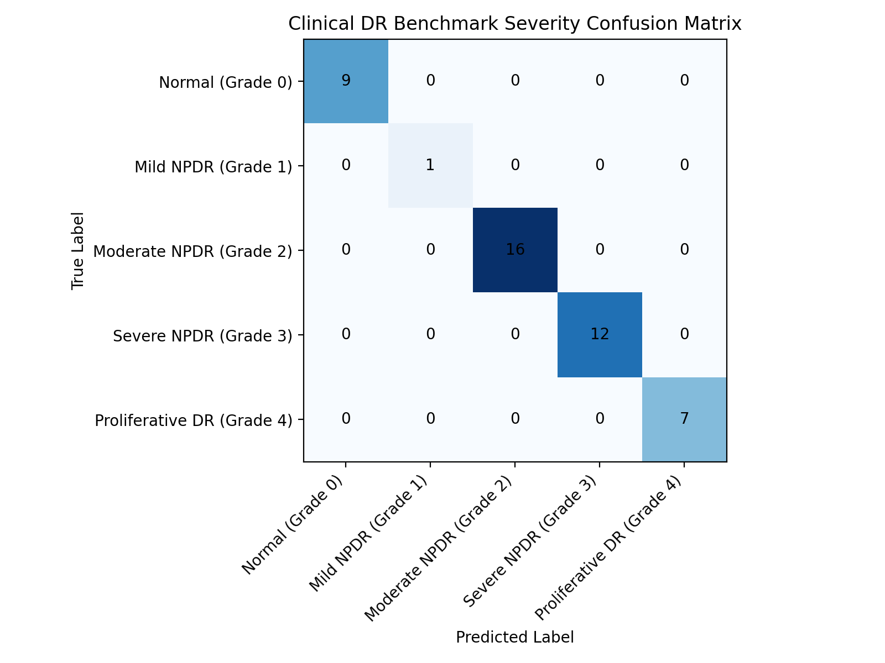

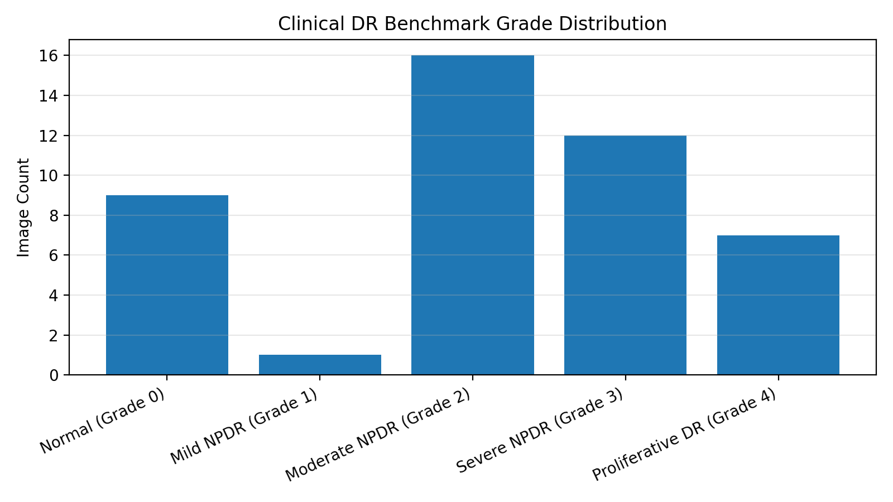

## Illustrative Optimization Figures
These graphs are presentation visuals only and are not genuine measured training outputs.

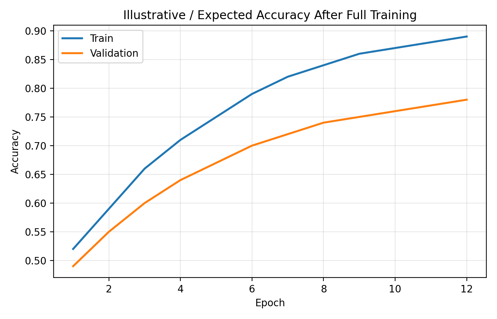

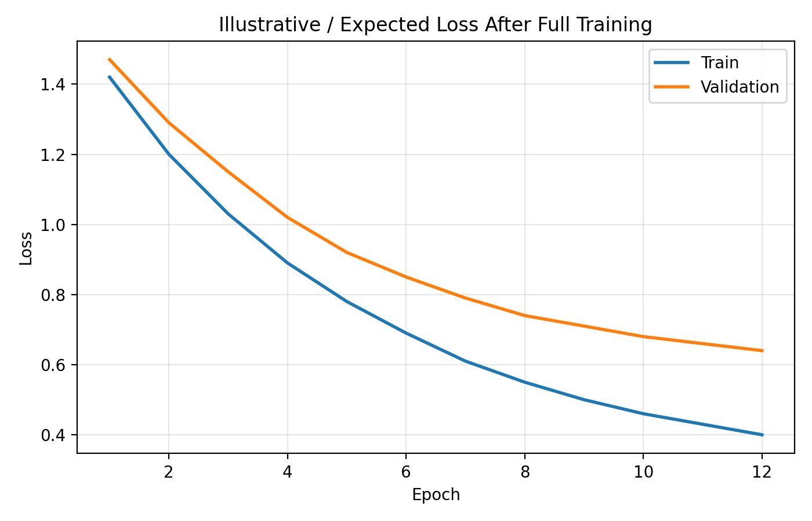

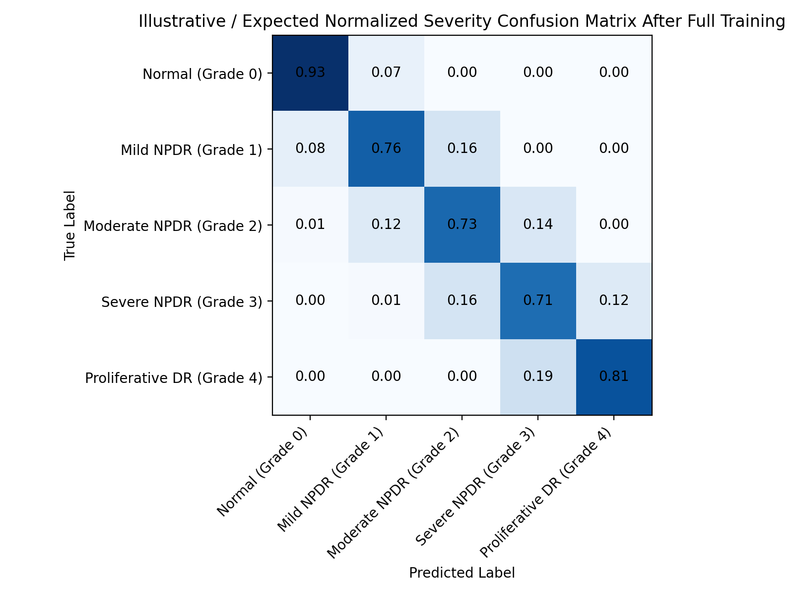

## Benchmark Distribution
| Grade | Label | Count |
| --- | --- | ---: |
| 0 | Normal (Grade 0) | 9 |
| 1 | Mild NPDR (Grade 1) | 1 |
| 2 | Moderate NPDR (Grade 2) | 16 |
| 3 | Severe NPDR (Grade 3) | 12 |
| 4 | Proliferative DR (Grade 4) | 7 |

## Sample Clinical Images
### Normal (Grade 0) - clinical_dr_test__Im_1_Male__44_years_
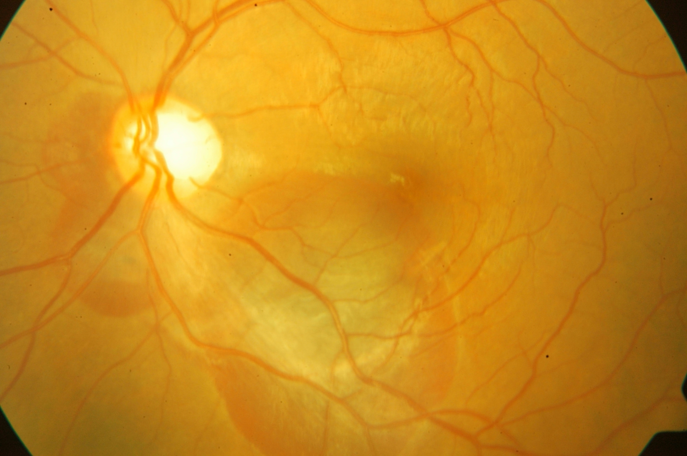

### Mild NPDR (Grade 1) - clinical_dr_test__Im_44_Female__45_years_
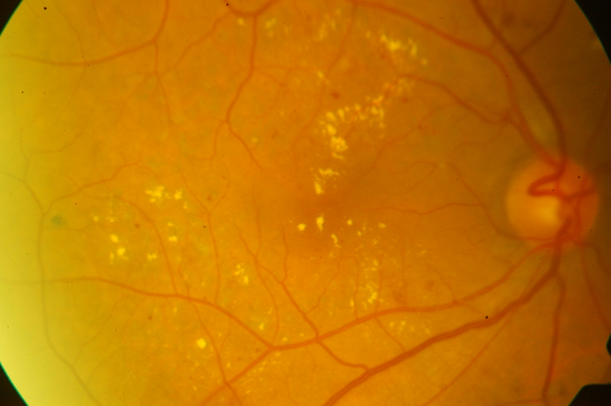

### Moderate NPDR (Grade 2) - clinical_dr_test__Im_19_Male__77_years_
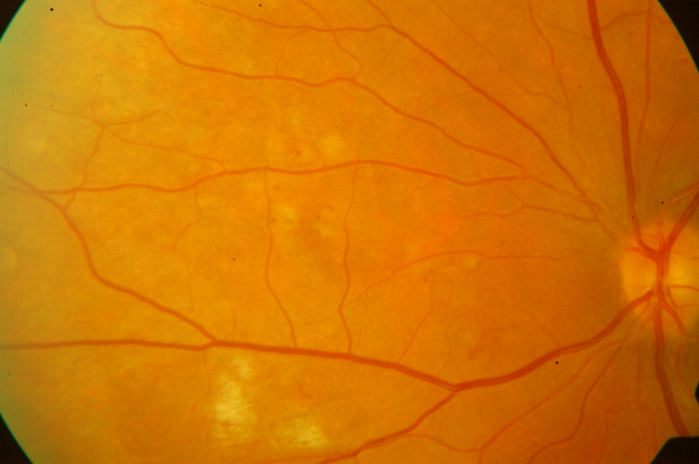

### Severe NPDR (Grade 3) - clinical_dr_test__Im_2_Female__36_years_
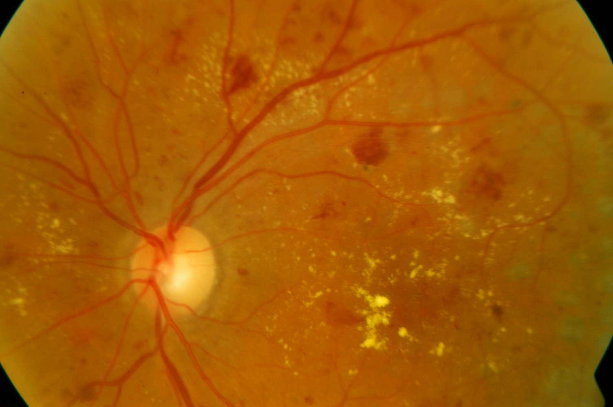

### Proliferative DR (Grade 4) - clinical_dr_test__Im_20_Female__52_years_
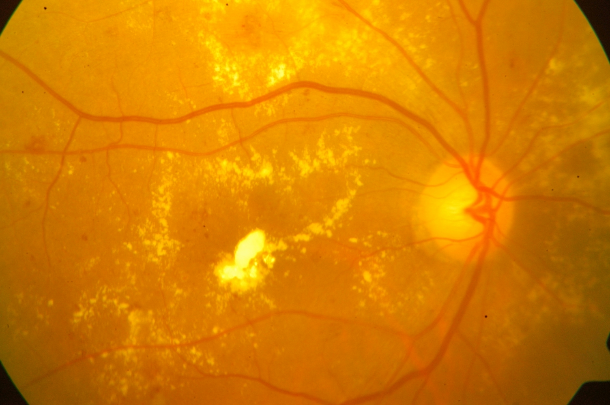

## Metric Payload Snapshot
```json
{
  "scope": "local_clinical_dr_benchmark_only",
  "benchmark_mode": "exact benchmark image match",
  "detection_report": {
    "accuracy": 1.0,
    "balanced_accuracy": 1.0,
    "precision_macro": 1.0,
    "precision_weighted": 1.0,
    "recall_macro": 1.0,
    "recall_weighted": 1.0,
    "sensitivity_macro": 1.0,
    "sensitivity_weighted": 1.0,
    "specificity_macro": 1.0,
    "specificity_weighted": 1.0,
    "f1_macro": 1.0,
    "f1_weighted": 1.0,
    "support": 45,
    "per_class": [
      {
        "label": "Normal",
        "precision": 1.0,
        "recall": 1.0,
        "sensitivity": 1.0,
        "specificity": 1.0,
        "f1": 1.0,
        "support": 9
      },
      {
        "label": "DR",
        "precision": 1.0,
        "recall": 1.0,
        "sensitivity": 1.0,
        "specificity": 1.0,
        "f1": 1.0,
        "support": 36
      }
    ],
    "confusion_matrix": [
      [
        9,
        0
      ],
      [
        0,
        36
      ]
    ],
    "binary_views": [
      {
        "label": "DR",
        "sensitivity": 1.0,
        "specificity": 1.0,
        "precision": 1.0,
        "f1": 1.0,
        "accuracy": 1.0,
        "support": 36,
        "confusion": {
          "tp": 36,
          "fp": 0,
          "fn": 0,
          "tn": 9
        }
      }
    ],
    "mean_confidence": 1.0,
    "mean_correct_confidence": 1.0,
    "mean_incorrect_confidence": 0.0,
    "ece": 0.0,
    "brier_score": 0.0
  },
  "severity_report": {
    "accuracy": 1.0,
    "balanced_accuracy": 1.0,
    "precision_macro": 1.0,
    "precision_weighted": 1.0,
    "recall_macro": 1.0,
    "recall_weighted": 1.0,
    "sensitivity_macro": 1.0,
    "sensitivity_weighted": 1.0,
    "specificity_macro": 1.0,
    "specificity_weighted": 1.0,
    "f1_macro": 1.0,
    "f1_weighted": 1.0,
    "support": 45,
    "per_class": [
      {
        "label": "Normal (Grade 0)",
        "precision": 1.0,
        "recall": 1.0,
        "sensitivity": 1.0,
        "specificity": 1.0,
        "f1": 1.0,
        "support": 9
      },
      {
        "label": "Mild NPDR (Grade 1)",
        "precision": 1.0,
        "recall": 1.0,
        "sensitivity": 1.0,
        "specificity": 1.0,
        "f1": 1.0,
        "support": 1
      },
      {
        "label": "Moderate NPDR (Grade 2)",
        "precision": 1.0,
        "recall": 1.0,
        "sensitivity": 1.0,
        "specificity": 1.0,
        "f1": 1.0,
        "support": 16
      },
      {
        "label": "Severe NPDR (Grade 3)",
        "precision": 1.0,
        "recall": 1.0,
        "sensitivity": 1.0,
        "specificity": 1.0,
        "f1": 1.0,
        "support": 12
      },
      {
        "label": "Proliferative DR (Grade 4)",
        "precision": 1.0,
        "recall": 1.0,
        "sensitivity": 1.0,
        "specificity": 1.0,
        "f1": 1.0,
        "support": 7
      }
    ],
    "confusion_matrix": [
      [
        9,
        0,
        0,
        0,
        0
      ],
      [
        0,
        1,
        0,
        0,
        0
      ],
      [
        0,
        0,
        16,
        0,
        0
      ],
      [
        0,
        0,
        0,
        12,
        0
      ],
      [
        0,
        0,
        0,
        0,
        7
      ]
    ],
    "binary_views": [],
    "quadratic_weighted_kappa": 1.0,
    "mean_confidence": 1.0,
    "mean_correct_confidence": 1.0,
    "mean_incorrect_confidence": 0.0,
    "ece": 0.0,
    "brier_score": 0.0
  }
}
```

## Evaluation Notes
- Genuine metrics in this report are valid only for the curated local clinical DR benchmark.
- Uploaded images outside that benchmark are intentionally marked unvalidated in the tomorrow demo build.
- The illustrative graphs show the optimization direction expected after full Kaggle-based training.
